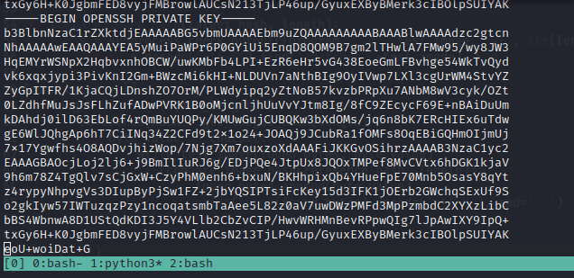

# congenial-winner
Known plaintext attack utilizing MD5 hashing performed by a predefined binary

This tool is used for reading privileged files, by abusing the capabilities assigned to the `scanner` binary in a certain HTB box.

## Instructions

Just run the python file. Supply the required arguments.

You'll need to estimate the number of characters in the file you're tring to dump.

